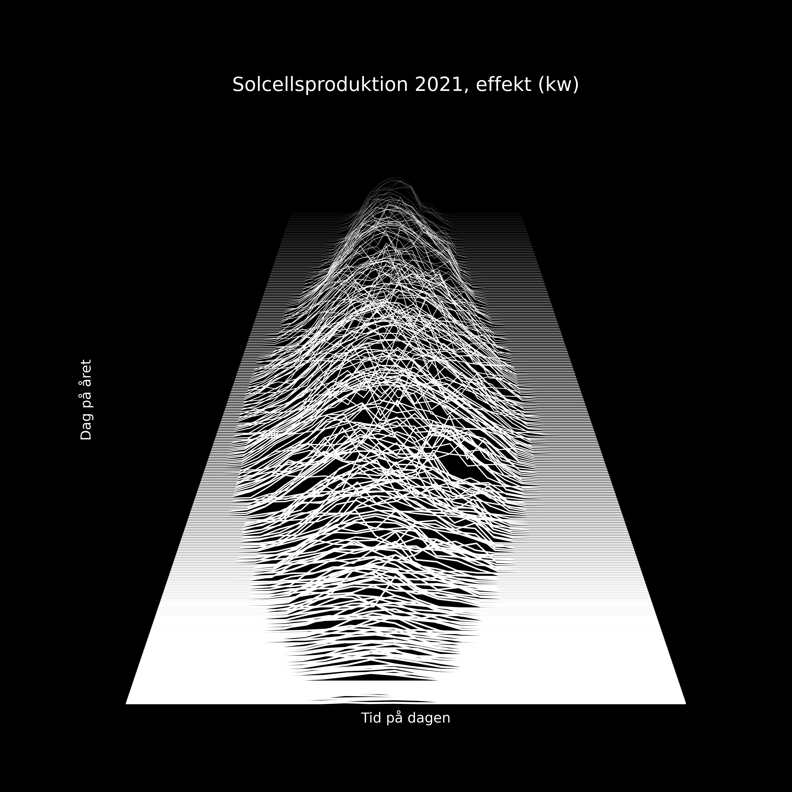
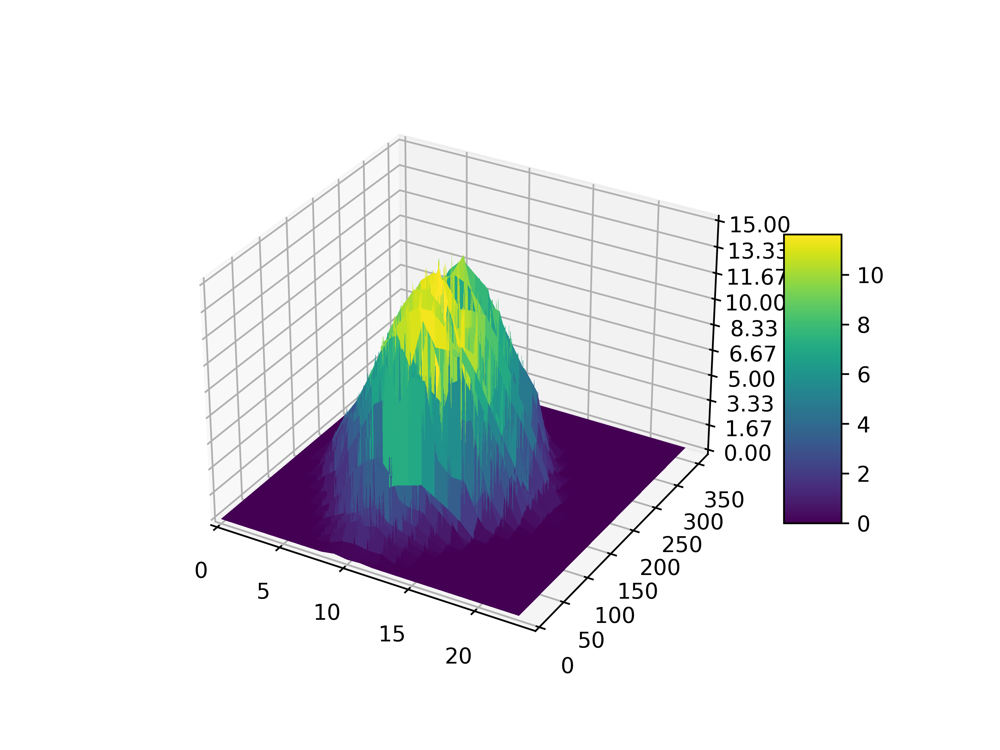

# sun-plots
This is my experiments with various visualizations of my solar panel production data using Python pandas and matplotlib.

- `sun_plot.py` result:

[comment]: <> (![Sun plot image]&#40;sun_plot.png&#41;)

- `sun_plot3d.py` result:

[comment]: <> (![Sun plot image]&#40;sun_plot3d.png&#41;)

